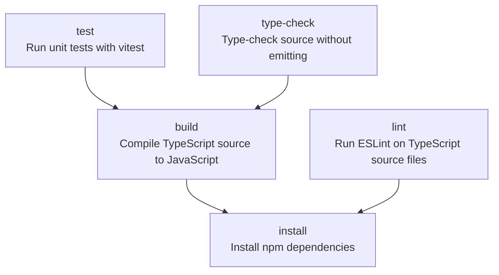
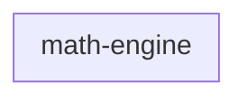
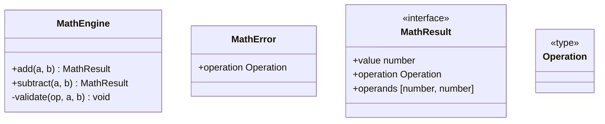

<!-- TOC:START -->
- [Starter project](#starter-project)
  - [Build Pipeline](#build-pipeline)
  - [Component Diagram](#component-diagram)
  - [Components Table](#components-table)
  - [Component Details](#component-details)
      - [math-engine](#math-engine)
  - [Try it](#try-it)
<!-- TOC:END -->

# Starter project

> **Seeded by `init` — safe to replace.** These starter files (this README, a
> `math-engine` component under `src/`, and `project.json`) exist so a brand-new
> project can run its tests, publish on push, and watch the doc generator work
> before you write any code. Replace them with your own whenever you like —
> `init` printed the exact paths to delete.

Run `npm run update-all-format` to fill the blocks below; GitHub renders the
Mermaid diagrams inline from the fenced blocks.

## Build Pipeline

<!-- NX_GRAPH:START -->

<!-- NX_GRAPH:END -->

## Component Diagram

<!-- UML:components:START -->

<!-- UML:components:END -->

## Components Table

<!-- UML:components-table:START -->
| Component | Description |
|-----------|-------------|
| [math-engine](#math-engine) | The math-engine component: a small, dependency-free arithmetic core |
<!-- UML:components-table:END -->

## Component Details

<!-- UML:component-details:START -->
#### math-engine

<!-- UML:component-details:END -->

## Try it

```bash
npm install                 # fetch the dev deps init declared
npm test                    # the seeded vitest test passes
npm run update-all-format   # fills the doc blocks above
git commit -am "feat: initial version" && git push   # feat:/fix: cut a release (npm publish if a library)
```
